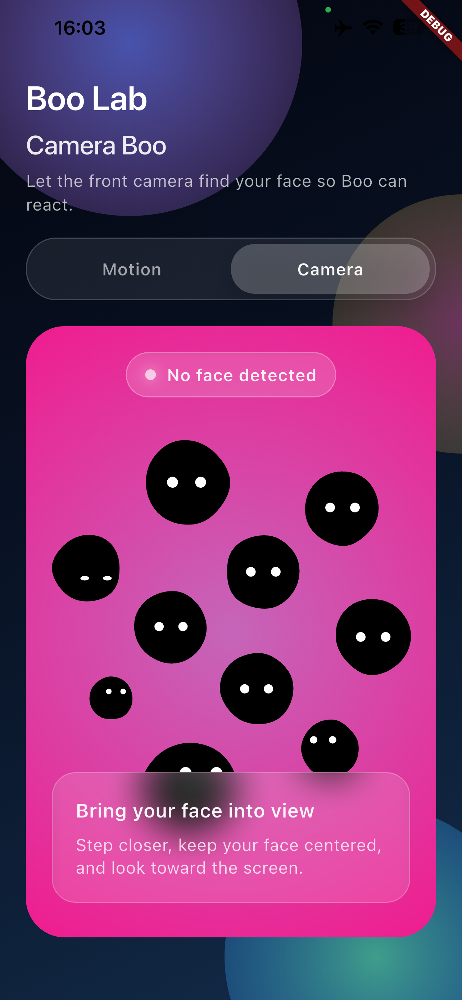

# Boo 👻

*A glassmorphic companion that responds to your face and your moves.*

## Overview

Boo is a Flutter-powered showcase of playful ambient interactions. It merges motion sensors, real-time camera analysis, and a liquid-glass UI to build a single immersive screen where Boo (our resident blob) reacts to the world around you.

This repository contains everything required to explore, run, and ship Boo on Android and iOS devices. The project is opinionated about lifecycle management, face detection, and delightful presentation—so feel free to borrow patterns for your own experiments.

## Highlights

- **Liquid Glass Hub**: One full-screen surface that blends blur, gradients, and layered glows.
- **Dual Experiences**: Toggle instantly between camera-reactive and motion-reactive Boo worlds.
- **Real-Time Face Detection**: Powered by Google ML Kit with NV21 conversion for Android parity.
- **iOS Stability**: Defensive camera lifecycle handling prevents preview freezes when backgrounding.
- **Automated Releases**: Every push builds split-per-ABI APKs and attaches them to a fresh GitHub release.

## Screenshots

| Motion Boo | Camera Boo |
| --- | --- |
|  |  |

## Quick Start

### Prerequisites

- Flutter 3.22+ (channel `stable`).
- Android Studio or Xcode toolchains installed for respective platforms.
- Device or emulator with camera access (for Camera Boo).

### Setup

```bash
flutter pub get
```

### Run

```bash
# Android
flutter run --release --target-platform android-arm64

# iOS (from macOS with configured signing)
flutter run --release
```

Grant camera and sensor permissions when prompted to unlock the full experience.

## Architecture Notes

- **`lib/boo/ui/experience_hub_page.dart`**: Hosts the liquid glass layout and manages experience toggling.
- **`lib/boo/ui/camera_boo_page.dart`**: Handles camera permissions, ML Kit face detection, and Boo reactions when you are in view.
- **`lib/boo/ui/motion_boo_page.dart`**: Couples device motion sensors with BooWorld physics when the camera is inactive.
- **`lib/boo/ui/boo_scene.dart` + `lib/boo/core/boo_world.dart`**: Render and animate Boo with shared state across experiences.

## Release Pipeline

Each push to the repository triggers a GitHub Actions workflow that:

1. Checks out the source and installs Flutter.
2. Builds release APKs for every ABI via `flutter build apk --split-per-abi --release`.
3. Creates a fresh release tagged with the current run number.
4. Uploads the generated `armeabi-v7a`, `arm64-v8a`, and `x86_64` APKs as assets.

You can download the latest prebuilt binaries from the **Releases** page without opening an IDE.

## Contributing

We welcome experiments, bug fixes, and whimsical ideas. To contribute:

1. Fork the repo.
2. Branch from `master` with a descriptive name.
3. Make your changes and add tests where relevant.
4. Run `flutter analyze` and `flutter test`.
5. Open a pull request describing the behavior you tweaked or the joy you added.

## License

Distributed under the MIT License. See [`LICENSE`](LICENSE) for details.
